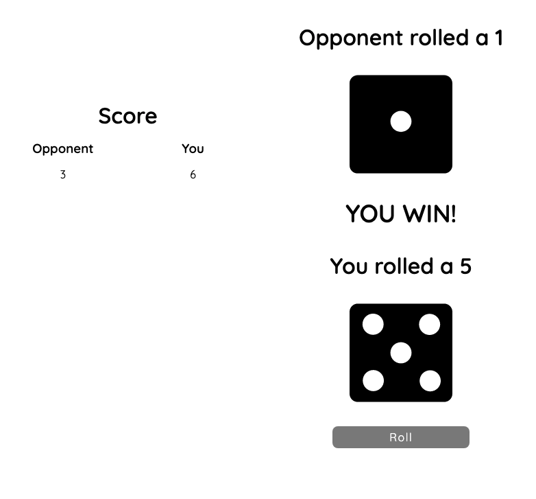

# Dice Roll Game

A game where the user competes against the computer by rolling random dice numbers.

## Game Rules

Press "Roll" to roll a random number. If your number is higher than the opponent's number, you win. If you rnumber is lower than the opponent's number, you lose. Alternatively, if both you and the opponent roll the same number, it's a draw and no one wins.

The score is a record of wins. Draws are not recorded.

## Included Technologies

- React.js
- SCSS
